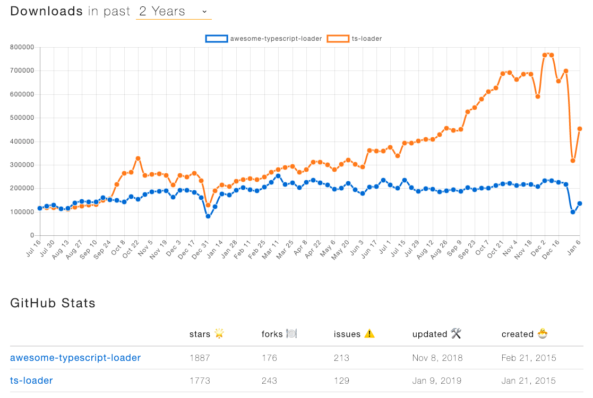

이 프로젝트는 [webpack_sample](https://github.com/LeeHyun-A/React/tree/master/webpack_sample)을 기반으로 typescript를 React에서 사용하는 방법에 대해 설명합니다.

React에서 PropTypes로 충분히 타입 체킹이 가능하지만 state, function parameters 등의 타입 체킹은 할 수 없다. 그래서 TypeScript를 적용해보고자 합니다.

> 해당 프로젝트는 React 관련 기본 세팅이 되어있다고 가정하고 설명합니다.
> CRA를 사용할 경우 옵션을 통해 쉽게 세팅할 수 있다.

```
create-react-app typescript-react-tutorial --scripts-version=react-scripts-ts
```

## 설치
```
npm i typescript ts-loader @types/react -D
```
React에서 사용되는 TypeScript Loader에는 두가지가 유명하다. 하나는 이 프로젝트 설명에서 사용된 ts-loader와 awesome-typescript-loader 이다.

두가지 loader의 차이점은 awesome-typescript-loader 페이지에서 아래와 같이 설명하고 있다.

## [Differences](https://github.com/s-panferov/awesome-typescript-loader#differences-between-ts-loader) between [ts-loader](https://github.com/TypeStrong/ts-loader)
> `awesome-typescript-loader` loader was created mostly to speed-up compilation in my own projects. Some of them are quite big and I wanted to have full control on how my files are compiled. There are two major points:
>  1. atl has first-class integration with Babel and enables caching possibilities. This can be useful for those who use Typescript with Babel. When useBabel and useCache flags are enabled, typescript's emit will be transpiled with Babel and cached. So next time if source file (+environment) has the same checksum we can totally skip typescript's and babel's transpiling. This significantly reduces build time in this scenario.
>  2. atl is able to fork type-checker and emitter to a separate process, which also speeds-up some development scenarios (e.g. react with react-hot-loader) So your webpack compilation will end earlier and you can explore compiled version in your browser while your files are typechecked.

### npm trends (awesome-typescript-loader vs. ts-loader)


[npm trends: awesome-typescript-loader vs. ts-loader](https://www.npmtrends.com/awesome-typescript-loader-vs-ts-loader)

npm trends 페이지에서 두 loader를 비교해 보니 awesome-typescript-loader가 start 수가 많지만 점점 사용량이 ts-loader가 많아져서 ts-loader를 사용하기로 결정했다.

## tsconfig.json 설정
```
{
  "compilerOptions": {
    "sourceMap": true,  // 소스맵(*.map) 파일 생성 여부
    "jsx": "react"  // Resolve: Cannot use JSX unless '--jsx' flag is provided
  }
}
```

## webpack.config.js 설정
```
...
module: {
  rules: [
    ...
    ,
    {
       test: /\.tsx?$/,
       loader: 'ts-loader'
    }
  ]
},
resolve: {
  modules: [path.join(__dirname, 'src'), 'node_modules'],
  extensions: ['.ts', '.tsx', '.js', '.jsx', '.css', '.scss', '.json'],
},
...
```

## component 생성
### index.tsx
```
import * as React from 'react';
import * as ReactDOM from 'react-dom';
import Ex1 from './components/Ex1';
ReactDOM.render(
  <Ex1 firstName="hyuna" lastName="lee"/>,
  document.getElementById('root')
);
```
아래 예제에 따라 render 함수의 첫번째 값을 변경해 준다.

### Ex1.tsx
```
import * as React from 'react';
interface Props {
  firstName: string;
  lastName: string;
}
export default class Ex1 extends React.Component<Props> {
  render() {
    const { firstName, lastName } = this.props;
    
    return (
      <div>
        {firstName} {lastName}
      </div>
    )
  }
}
```

### Ex2.tsx
```
import * as React from 'react';

interface Props {
  firstName: string;
  lastName: string;
}

// JSX 리턴을 하지 않을 경우 에러가 Ex2가 아닌 index.tsx 에서 발생
// https://github.com/Mercateo/react-with-typescript#stateless-functional-components
/*
export default ({firstName, lastName}: Props) => (
  <div>
    {firstName} {lastName}
  </div>
);
*/

// React.StatelessComponent 와 React.SFC 는 deprecated 됨
const Ex2: React.FunctionComponent<Props> = ({firstName, lastName}) => (
  <div>
    {firstName} {lastName}
  </div>
);

export default Ex2;
```
function component로 사용할 경우 React.FunctionComponent 타입을 꼭 지정해주자. 사용을 안해도 큰 문제는 없지만 만약 Ex2 컴포넌트에서 JSX타입이 아닌 다른 타입을 return 할 경우 error가 Ex2에서 발생하는 것이 아니라 index.tsx에서 발생한다.

>React.StatelessComponent와 React.SFC는 deprecated되었으므로 React.FunctionComponent를 사용하면 된다.

### Ex3.tsx
```
import * as React from 'react';

interface Props {
  children: any;
}

interface State {
  counter: number;
}

export default class Ex3 extends React.Component<Props, State> {
  state = {
    counter: 0
  };

  handleClick = (): void => {
    const { counter } = this.state;

    this.setState({
      counter: counter + 1
    });
  };

  render() {
    const { children } = this.props;
    const { counter } = this.state;
    return (
      <>
        <button onClick={this.handleClick}>{children}</button>
        <div>{counter}</div>
      </>
    )
  }
}
```

Ex3.tsx — index.tsx
```
import * as React from 'react';
import * as ReactDOM from 'react-dom';
import Ex3 from './components/Ex3';

ReactDOM.render(
 <Ex3>clickButton</Ex3>,
 document.getElementById('root')
);
```

---

## TypeScript 적용 관련 에러
### TS2339: Property ‘props’ does not exist on type
: props 인식 불가 에러
```
npm i @types/react -D
```
### TS1192: Modele “A.module” has no default export
: React 인식 불가 에러
```
import React from 'react';
=>
import * as React from 'react';
```

## 실행
```
npm run build
npm run dev
```
[localhost:8000](localhost:8000)
